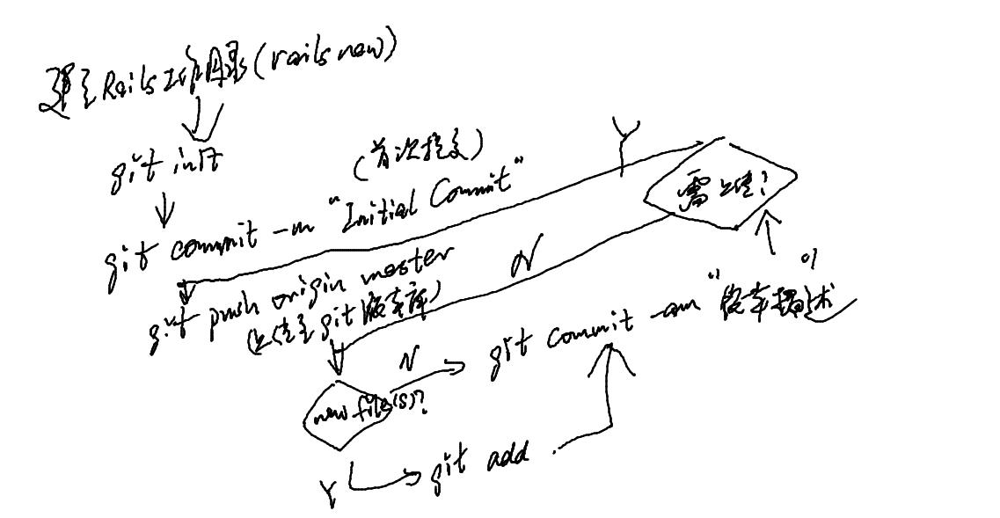

# 系统功能的设计与实现

## 开发工具和运行环境

<table>
    <tr>
        <td>操作系统</td>
        <td>Ubuntu 14.04</td>
    </tr>

    <tr>
        <td>数据库</td>
        <td>SQLite</td>
    </tr>

    <tr>
        <td>Web服务器</td>
        <td>Webrick</td>
    </tr>

    <tr>
        <td>开发框架</td>
        <td>Rails 4.1.6</td>
    </tr>

    <tr>
        <td>开发语言</td>
        <td>Ruby 2.1.2p95</td>
    </tr>

    <tr>
        <td>文本编辑器</td>
        <td>Sublime Text 3</td>
    </tr>

</table>

## 系统实现的相关技术

### [Ruby语言](http://www.w3cschool.cc/ruby/ruby-intro.html)

Ruby是一种纯粹的面向对象编程语言。
它由日本的松本行弘（まつもとゆきひろ/YukihiroMatsumoto）创建于1993年。
Ruby的特性与Smalltalk、Perl和Python类似。
Perl、Python和Smalltalk是脚本语言。
Smalltalk是一个真正的面向对象语言。
Ruby，与Smalltalk一样，是一个完美的面向对象语言。
使用Ruby的语法比使用Smalltalk的语法要容易得多。

Ruby的特性. 

* Ruby是开源的，在Web上免费提供，但需要一个许可证。
* Ruby是一种通用的、解释的编程语言。
* Ruby是一种真正的面向对象编程语言。
* Ruby是一种类似于Python和Perl的服务器端脚本语言。
* Ruby可以用来编写通用网关接口（CGI）脚本。
* Ruby可以被嵌入到超文本标记语言（HTML）。
* Ruby语法简单，这使得新的开发人员能够快速轻松地学习Ruby。
* Ruby与C++和Perl等许多编程语言有着类似的语法。
* Ruby可扩展性强，用Ruby编写的大程序易于维护。
* Ruby可用于开发的Internet和Intranet应用程序。
* Ruby可以安装在Windows和POSIX环境中。
* Ruby支持许多GUI工具，比如Tcl/Tk、GTK和OpenGL。
* Ruby可以很容易地连接到DB2、MySQL、Oracle和Sybase。
* Ruby有丰富的内置函数，可以直接在Ruby脚本中使用。

### [Ruby on Rails (Rails)框架](http://zh.wikipedia.org/wiki/Ruby_on_Rails)

Ruby on Rails简称Rails，是一个使用Ruby语言写的开源Web应用框架。
Ruby语言以自然、简洁、快速著称，全面支持面向对象程序设计，而Rails则是Ruby广泛应用方式之一，在Rails平台上设计出一套独特的MVC开发架构，采取模型（Model）、外观（View）、控制器（Controller）分离的开发方式，不但减少了开发中的问题，更简化了许多繁复的动作。
它努力使自身保持简单，来使实际的应用开发时的代码更少，使用最少的配置。
Rails的设计原则包括“不做重复的事”（Don't Repeat Yourself）和“惯例优于设置”（Convention Over Configuration)。

### [SASS](http://blog.csdn.net/lee_magnum/article/details/11776785)

Sass 是一种基于ruby编写的CSS预处理器。
它诞生于2007年，是最早也是最成熟的一款CSS预处理器语言。
它可以使用变量、嵌套、混入、继承，运算，函数等功能，使得CSS的开发，变得简单清晰可维护，同时也大大节省了设计者的时间，提高了效率。

### [jQuery](http://zh.wikipedia.org/wiki/JQuery#.E7.89.B9.E7.82.B9)

jQuery是一套跨浏览器的JavaScript库，简化HTML与JavaScript之间的操作。
由John Resig在2006年1月的BarCamp NYC上发布第一个版本。
目前是由Dave Methvin领导的开发团队进行开发。
全球前10000个访问最高的网站中，有65%使用了jQuery，是目前最受欢迎的JavaScript库。 

jQuery是开源软件，使用MIT许可证授权。jQuery的语法设计使得许多操作变得容易，如操作文档对象（document）、选择DOM元素、创建动画效果、处理事件、以及开发Ajax程序。jQuery也提供了给开发人员在其上创建插件的能力。这使开发人员可以对底层交互与动画、高级效果和高级主题化的组件进行抽象化。模块化的方式使jQuery函数库能够创建功能强大的动态网页以及网络应用程序。

### [AJAX](http://zh.wikipedia.org/wiki/AJAX)

#### AJAX简介

Ajax即“Asynchronous JavaScript and XML”（异步的JavaScript与XML技术），指的是一套综合了多项技术的浏览器端网页开发技术。Ajax的概念由Jesse James Garrett所提出。 

传统的Web应用允许用户端填写表单（form），当提交表单时就向Web服务器发送一个请求。
服务器接收并处理传来的表单，然后送回一个新的网页，但这个做法浪费了许多带宽，因为在前后两个页面中的大部分HTML码往往是相同的。
由于每次应用的沟通都需要向服务器发送请求，应用的回应时间依赖于服务器的回应时间。
这导致了用户界面的回应比本机应用慢得多。 

与此不同，Ajax应用可以仅向服务器发送并取回必须的数据，并在客户端采用JavaScript处理来自服务器的回应。
因为在服务器和浏览器之间交换的数据大量减少（大约只有原来的5%）,服务器回应更快了。
同时，很多的处理工作可以在发出请求的客户端机器上完成，因此Web服务器的负荷也减少了。

#### Rails中的Ajax

Ajax（异步JavaScript与XML）是一种异步传输接口，可以借由浏览器使用JavaScript和XML或其他数据格式来处理传输请求，而将Web服务器作为后台来处理，这样无须载入额外的网页。
Rails内置有Prototype套件来实现这个技术。
Ajax已经和Ruby on Rails结合在了一起成为了一个新的系统叫做“Ajax on Rails”。
Rails提供一些助手工具来更方便地实现Ajax应用。
Rails提供了一些Helper，可以在服务器一端用纯Ruby语言生成给浏览器用的JavaScript代码，从而让Rails的开发者不需掌握JavaScript就可以简单方便的开发出Ajax的应用。

## 系统模型和数据库的设计
### 创建模型
### 系统数据库的设计
### 模型之间建立关联

## 系统主要模块的实现
### RubyGems
### 用户注册模块
### 权限管理模块
### 购物车模块
### 订单模块
### 邮件发送模块
### 多国语言模块

## 版本控制系统Git

### Git简介

Git是一个开源的分布式版本控制系统，用以有效、高速的处理从很小到非常大的项目版本管理。

从一般开发者的角度来看，git有以下功能。

1. 从服务器上克隆数据库（包括代码和版本信息）到单机上。
2. 在自己的机器上创建分支，修改代码。
3. 在单机上自己创建的分支上提交代码。
4. 在单机上合并分支。
5. 新建一个分支，把服务器上最新版的代码fetch下来，然后跟自己的主分支合并。
6. 生成补丁（patch），把补丁发送给主开发者。
7. 看主开发者的反馈，如果主开发者发现两个一般开发者之间有冲突（他们之间可以合作解决的冲突），就会要求他们先解决冲突，然后再由其中一个人提交。如果主开发者可以自己解决，或者没有冲突，就通过。
8. 一般开发者之间解决冲突的方法，开发者之间可以使用pull 命令解决冲突，解决完冲突之后再向主开发者提交补丁。

### [Git主要命令介绍](http://blog.csdn.net/hangyuanbiyesheng/article/details/6731629)

* git init : 初始化当前目录为Git版本控制的目录,在当前目录中产生一个.git 的子目录。
以后，所有的文件变化信息都会保存到这个目录下。
* git commit : 提交当前工作目录的修改内容。
直接调用git commit命令，会提示填写注释。
通过如下方式在命令行就填写提交注释：git commit -m "这里填写注释"。
git commit还有一个-a的参数，可以将那些没有通过git add标识的变化一并强行提交。
如需同时使用-a和-m参数可直接使用-am。
* git status : 查看版本库的状态。
可以得知哪些文件发生了变化，
哪些文件还没有添加到git库中等等。 
建议每次commit前都要通过该命令确认库状态。
* git branch ： 列出本地git库中的所有分支。
在列出的分支中，若分支名前有*，则表示此分支为当前分支。
在git版本库中创建分支的成本几乎为零，所以，不必吝啬多创建几个分支。
当第一次执行git init时，系统就会创建一个名为“master”的分支。
而其它分支则通过手工创建。
* git checkout 分支名 : 切换到某个分支。（只有当前工作分支的更改全部通过git commit提交后才可允许切换分支）
* git checout -b 分支名 : 创建该分支名同时将当前工作分支切换到了该分支上。 
* git merge : 把服务器上下载下来的代码和本地代码合并，或者进行分支合并。
* git push origin branch-name ： 提交本地分支branch-name至在线版本库
（origin只相当于一个别名，运行git remote –v或者查看.git/config可以看到origin的含义，一般指git版本库，如需将代码部署至Heroku则需将origin改为heroku)，
只有当前工作分支的更改全部通过git commit提交后才可使用git push命令。
* git log : 查看历史日志，包含每次的版本变化。每次版本变化对应一个commit id。 

### 本系统运用Git进行版本控制的主要流程
 // Lacks the branch part
### GitHub简介

[GitHub](http://zh.wikipedia.org/wiki/GitHub#.E4.B8.AD.E5.9B.BD.E5.A4.A7.E9.99.86)是目前最流行的Git访问站点，它是一个共享虚拟主机服务，用于存放使用Git版本控制的软件代码和内容项目。
GitHub同时提供付费账户和为开源项目提供的免费账户。
许多赫赫有名的程序库、开发框架都采用GitHub作为为主版本控制平台，其中包括[jQuery](https://github.com/jquery/jquery
), [PHP](https://github.com/php
), 以及本系统使用的开发语言[Ruby](https://github.com/ruby/ruby
)和开发框架[Rails](https://github.com/rails/rails/
)。

### Git在本系统中的运用

#### 分支(branch)

本系统中的[所有代码](https://github.com/jeremylinlin/online-bookstore)利用GitHub提供的免费账户进行代码托管，其中包含若干个分支(branch)和一个主分支(master)。
一般说来，一个分支通常被用来完成某种特定的功能，当此分支的功能被完成后则会被合并(merge)至master分支。
在开源项目中，分支往往用来被多个开发者新建用来完成不同的功能。
在本系统中，分支主要被用来区分开发的不同阶段。

#### 提交（commit）

## 云应用部署平台Heroku

##系统展示
