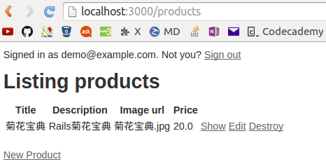
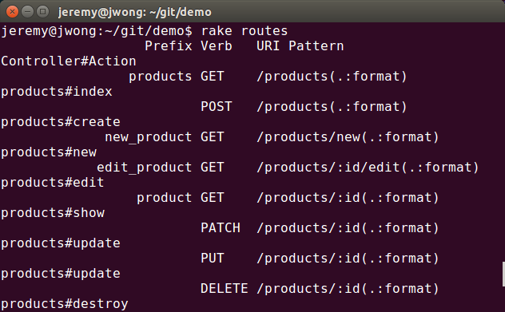

# 系统功能的设计与实现

## 开发工具和运行环境[DONE]

----------------     ------------------------
    操作系统                Ubuntu 14.04

    数据库                   SQLite

    Web服务器               Webrick

    开发框架                Rails 4.1.5

    开发语言                Ruby 2.1.2p95

    文本编辑器              Sublime Text 3
----------------     -----------------------

Table: 开发工具和运行环境

## Rails 简介与其特性介绍

### Rails 是什么？

Rails 是使用 Ruby 语言编写的网页程序开发框架，目的是为开发者提供常用组件，简化网页程序的开发。
只需编写较少的代码，就能实现其他编程语言或框架难以企及的功能。
经验丰富的 Rails 程序员会发现，Rails 让程序开发变得更有乐趣。

Rails 有自己的一套规则，认为问题总有最好的解决方法，而且建议使用最好的方法，有些情况下甚至不推荐使用其他替代方案。
学会如何按照 Rails 的思维开发，能极大提高开发效率。
如果坚持在 Rails 开发中使用其他语言中的旧思想，尝试使用别处学来的编程模式，开发过程就不那么有趣了。

Rails 哲学包含两大指导思想：

* **不要自我重复（DRY, Don't Repeat Yourself）：**
DRY 是软件开发中的一个原则，“系统中的每个功能都要具有单一、准确、可信的实现。”。
不重复表述同一件事，写出的代码才能更易维护，更具扩展性，也更不容易出问题。
* **多约定，少配置：**
Rails 为网页程序的大多数需求都提供了最好的解决方法，而且默认使用这些约定，不用在长长的配置文件中设置每个细节。

### Rails 脚手架 (Rails Scaffolding)

脚手架是一种被许多基于 MVC 框架应用的技术。
在 Rails 中，开发者可以通过 generate 命令生成大量的代码并获得一个具有全部 CRUD 动作的 MVC 结构。

### [Rails 中的 HTTP 请求](file:///home/jeremy/Documents/Ruby%20on%20Rails/Single%20Page%20%20%20Ruby%20on%20Rails%20Tutoridal%20%20%20Softcover.io_files/Single%20Page%20%20%20Ruby%20on%20Rails%20Tutorial.html#sidebar-get_etc)

GET 是最常用的 HTTP 操作，用来从网络上读取数据，它的意思是“读取一个网页”。
当访问如 baidu.com 或 www.shnu.edu.cn 时，浏览器发出的就是 GET 请求。
POST 是第二种最常用的操作，当提交表单时浏览器发送的就是 POST 请求。
在 Rails 应用程序中，POST 请求一般被用来创建某个东西（不过 HTTP 也允许 POST 进行更新操作）。
例如，在提交注册表单时发送的 POST 请求就会在网站中创建一个新用户。

剩下的两个动词，PATCH 和 DELETE 分别用来更新和销毁服务器上的某个东西。这两个操作比 GET 和 POST 少用一些，因为浏览器没有内建对这两种请求的支持，不过有些 Web 框架（比如 Rails）通过一些巧妙的处理方式，看起来就像是浏览器发出的一样。

另外，在 Rails 之前的版本中，没有使用 PATCH，用的是 PUT，Rails 4 仍然支持 PUT，但 PATCH 能更好的表明 HTTP 请求的意图。

## 系统实现的相关技术[DONE]

### [Ruby语言](http://www.w3cschool.cc/ruby/ruby-intro.html)

Ruby是一种纯粹的面向对象编程语言。
它由日本的松本行弘（まつもとゆきひろ/YukihiroMatsumoto）创建于1993年。
Ruby的特性与Smalltalk、Perl和Python类似。
Perl、Python和Smalltalk是脚本语言。
Smalltalk是一个真正的面向对象语言。
Ruby，与Smalltalk一样，是一个完美的面向对象语言。
使用Ruby的语法比使用Smalltalk的语法要容易得多。

Ruby的特性：

* Ruby是开源的，在Web上免费提供，但需要一个许可证。
* Ruby是一种通用的、解释的编程语言。
* Ruby是一种真正的面向对象编程语言。
* Ruby是一种类似于Python和Perl的服务器端脚本语言。
* Ruby可以用来编写通用网关接口（CGI）脚本。
* Ruby可以被嵌入到超文本标记语言（HTML）。
* Ruby语法简单，这使得新的开发人员能够快速轻松地学习Ruby。
* Ruby与C++和Perl等许多编程语言有着类似的语法。
* Ruby可扩展性强，用Ruby编写的大程序易于维护。
* Ruby可用于开发的Internet和Intranet应用程序。
* Ruby可以安装在Windows和POSIX环境中。
* Ruby支持许多GUI工具，比如Tcl/Tk、GTK和OpenGL。
* Ruby可以很容易地连接到DB2、MySQL、Oracle和Sybase。
* Ruby有丰富的内置函数，可以直接在Ruby脚本中使用。

### [Ruby on Rails (Rails)框架](http://zh.wikipedia.org/wiki/Ruby_on_Rails)

Ruby on Rails简称Rails，是一个使用Ruby语言写的开源Web应用框架。
Ruby语言以自然、简洁、快速著称，全面支持面向对象程序设计，而Rails则是Ruby广泛应用方式之一，在Rails平台上设计出一套独特的MVC开发架构，采取模型（Model）、外观（View）、控制器（Controller）分离的开发方式，不但减少了开发中的问题，更简化了许多繁复的动作。
它努力使自身保持简单，来使实际的应用开发时的代码更少，使用最少的配置。
Rails的设计原则包括“不做重复的事”（Don't Repeat Yourself）和“惯例优于设置”（Convention Over Configuration)。

### [SASS](http://blog.csdn.net/lee_magnum/article/details/11776785)

Sass 是一种基于ruby编写的CSS预处理器。
它诞生于2007年，是最早也是最成熟的一款CSS预处理器语言。
它可以使用变量、嵌套、混入、继承，运算，函数等功能，使得CSS的开发，变得简单清晰可维护，同时也大大节省了设计者的时间，提高了效率。

### [jQuery](http://zh.wikipedia.org/wiki/JQuery#.E7.89.B9.E7.82.B9)

jQuery是一套跨浏览器的JavaScript库，简化HTML与JavaScript之间的操作。
由John Resig在2006年1月的BarCamp NYC上发布第一个版本。
目前是由Dave Methvin领导的开发团队进行开发。
全球前10000个访问最高的网站中，有65%使用了jQuery，是目前最受欢迎的JavaScript库。 

jQuery是开源软件，使用MIT许可证授权。jQuery的语法设计使得许多操作变得容易，如操作文档对象（document）、选择DOM元素、创建动画效果、处理事件、以及开发Ajax程序。jQuery也提供了给开发人员在其上创建插件的能力。这使开发人员可以对底层交互与动画、高级效果和高级主题化的组件进行抽象化。模块化的方式使jQuery函数库能够创建功能强大的动态网页以及网络应用程序。

### [AJAX](http://zh.wikipedia.org/wiki/AJAX)

#### AJAX简介

Ajax即“Asynchronous JavaScript and XML”（异步的JavaScript与XML技术），指的是一套综合了多项技术的浏览器端网页开发技术。Ajax的概念由Jesse James Garrett所提出。 

传统的Web应用允许用户端填写表单（form），当提交表单时就向Web服务器发送一个请求。
服务器接收并处理传来的表单，然后送回一个新的网页，但这个做法浪费了许多带宽，因为在前后两个页面中的大部分HTML码往往是相同的。
由于每次应用的沟通都需要向服务器发送请求，应用的回应时间依赖于服务器的回应时间。
这导致了用户界面的回应比本机应用慢得多。 

与此不同，Ajax应用可以仅向服务器发送并取回必须的数据，并在客户端采用JavaScript处理来自服务器的回应。
因为在服务器和浏览器之间交换的数据大量减少（大约只有原来的5%）,服务器回应更快了。
同时，很多的处理工作可以在发出请求的客户端机器上完成，因此Web服务器的负荷也减少了。

#### Rails中的Ajax

Ajax（异步JavaScript与XML）是一种异步传输接口，可以借由浏览器使用JavaScript和XML或其他数据格式来处理传输请求，而将Web服务器作为后台来处理，这样无须载入额外的网页。
Rails内置有Prototype套件来实现这个技术。
Ajax已经和Ruby on Rails结合在了一起成为了一个新的系统叫做“Ajax on Rails”。
Rails提供一些助手工具来更方便地实现Ajax应用。
Rails提供了一些Helper，可以在服务器一端用纯Ruby语言生成给浏览器用的JavaScript代码，从而让Rails的开发者不需掌握JavaScript就可以简单方便的开发出Ajax的应用。

## 系统模型和数据库的设计

### 系统数据库的设计

根据对项目的需求分析以及系统用例图，提取业务所需要实体，设计系统的数据库表，如下表所示。

------------    --------------------    --------------------
     序号              表名                     描述
------------    --------------------    --------------------
      1              users                    所有用户信息

      2              products                 商品信息

      3              carts                    购物车

      4              line_items               购物车中的商品

      5              categories               商品分类

      6              categorizations          商品与分类的配对  

      7              orders                   用户订单
------------    --------------------    ---------------------

Table: 系统数据库表

### 创建模型

在 Rails 中，模型的名字使用开头大写的单数，对应的数据表名使用小写的复数。
Rails 提供了一个生成器 (generator) 用来创建模型，大多数 Rails 开发者创建模型时都会使用。
以下以创建订单模型为例，我们在终端里执行下面的命令：

    $ rails generate model Order name address:text email pay_type # 未声明数据类型的默认为 string 类型

生成下列文件

后两个为模型的测试用例，我们关心的是前两个文件。
第一个文件是 Rails 的数据迁移文件，用来通过相关命令对数据库进行迁移（如创建数据表，添加字段等）。

第二个则是真正的订单模型文件，用来验证属性有效性、定义实现功能的相关方法等。

之后我们执行

    rake db:migrate

进行数据库的迁移

Rails 会执行迁移操作，并提示创建了 orders 表。

### 模型之间建立关联

#### [Active Record 关联](http://guides.rubyonrails.org/association_basics.html)

在 Rails 中，关联是两个 Active Record 模型之间的关系。
关联使用宏的方式实现，用声明的形式为模型添加功能。
例如，声明一个模型属于（belongs_to）另一个模型后，Rails 会维护两个模型之间的“主键-外键”关系，而且还向模型中添加了很多实用的方法。
Rails 支持六种关联：

1. belongs_to 关联

    belongs_to 关联创建两个模型之间一对一的关系，声明所在的模型实例属于另一个模型的实例。
    例如，如果程序中有用户和订单两个模型，每个订单只能指定给一个用户，就要这么声明订单模型：

        class Order < ActiveRecord::Base
          belongs_to :user
        end
2. has_one 关联

    has_one 关联也会建立两个模型之间的一对一关系，但语义和结果有点不一样。
    这种关联表示模型的实例包含或拥有另一个模型的实例。
    例如，在程序中，每一个用户只能有一个购物车，那么可以这么定义用户模型：

        class User < ActiveRecord::Base
            has_one :cart, dependent: :destroy
        end

    在这里，dependent: :destroy 表示销毁 User 对象的一个实例时，也会在其关联的实例 Cart 上调用 destroy 方法将其销毁。
3. has_many 关联

    has_many 关联建立两个模型之间的一对多关系。
    在 belongs_to 关联的另一端经常会使用这个关联。
    has_many 关联表示模型的实例有零个或多个另一个模型的实例。
    例如，在程序中有用户和订单两个模型，用户模型可以这么定义：

        class User < ActiveRecord::Base
            has_many :orders
        end
4. has_many :through 关联

    has_many :through 关联经常用来建立两个模型之间的多对多关联。
    这种关联表示一个模型的实例可以借由第三个模型，拥有零个和多个另一个模型的实例。
    例如，在产品的分类中，
    一种产品可以有多种分类（配对）的方式；
    而一种分类也可以有多种（与产品一对一）分配的方式（这种方式即为 Categorization）。
    依此，我们可以建立第三个模型 Categorization。
    这中间的关联声明如下：

        class Product < ActiveRecord::Base
            has_many :categories, through: :categorizations
            has_many :categorizations
        end 

        class Categorization < ActiveRecord::Base
            belongs_to :product
            belongs_to :category
        end

        class Category < ActiveRecord::Base
            has_many :products, through: :categorizations
            has_many :categorizations
        end
5. has_one  :through 关联

    has_one :through 关联建立两个模型之间的一对一关系。
    这种关联表示一个模型通过第三个模型拥有另一个模型的实例。
    例如，每个用户都只有一个账户，而且每个账户都有一个账户历史记录信息，那么可以这么定义模型：

        class User < ActiveRecord::Base
          has_one :account
          has_one :account_history, through: :account
        end
         
        class Account < ActiveRecord::Base
          belongs_to :user
          has_one :account_history
        end
         
        class AccountHistory < ActiveRecord::Base
          belongs_to :account
        end
6. has_and_belongs_to_many 关联

    has_and_belongs_to_many 关联之间建立两个模型之间的多对多关系，而不借由第三个模型。
    因此，以上的 has_many :through 关联中的模型也可如此定义：

        class Product < ActiveRecord::Base
          has_and_belongs_to_many :categories
        end
         
        class Category < ActiveRecord::Base
          has_and_belongs_to_many :products
        end

    当然，我们相应地也需要利用 rake db:migrate 命令来创建一张[连接数据表](http://api.rubyonrails.org/classes/ActiveRecord/Associations/ClassMethods.html#method-i-has_and_belongs_to_many)，迁移文件内容如下：

        class CreateCategoriesProductsJoinTable < ActiveRecord::Migration
          def change
            create_table :categories_products, id: false do |t|  # 不创建自动编号的 id 栏
              t.integer :category_id
              t.integer :products_id
            end
          end
        end

    Rails 提供了两种建立模型之间多对多关系的方法。
    其中比较简单的是以上的 has_and_belongs_to_many，可以直接建立关联。
    （不过必须要在数据库中创建如以上的连接数据表）

    当然该方法本身也有一些限制。
    和 has_many :through 关联相比，该方法不能将第三个模型作为独立实体使用，
    而仅仅只有一张连接数据表；
    另外在这张连接数据表中，也不能添加额外的属性。

#### 系统模型关联的建立

## 系统主要模块的实现
### RubyGems

RubyGems（简称 gems）是一个用于对 Ruby 组件进行打包的 Ruby 打包系统，它使得定位、安装、升级和卸载Ruby包变得容易。
它提供一个分发 Ruby 程序和库的标准格式，还提供一个管理程序包安装的工具。
RubyGems的功能类似于 Linux 下的 apt-get 。

### [Bundler](http://www.yakjuly.com/2010/07/rails3-use-bundler-manage-gems.html)

Bundler 是为 Rails 量身打造的基于 RubyGems 的更高阶 Ruby 组件管理工具，它适合让 Rails 应用管理多套 gems 依存关系的复杂情境。
而在 Rails 中要使用的 gems，也都必须包括在它的 Gemfile 里。
在使用 Bundler 的环境中，要使用任何的 RubyGem 都必须通过 Gemfile 管理。

Gemfile 的写法大致如下：

    # 第二个参数可以指定版本
    gem "rails", "4.1.5"
     
    # 如果 require 的名称不同，可以加上 :require
    gem "sqlite3-ruby", :require => "sqlite3"
     
    # 可以用 Git 当做来源，甚至可以指定 branch, tag 或 ref。
    gem "authlogic", :git => "git://github.com/odorcicd/authlogic.git",
    :branch => "rails3"
     
    # 可以直接用电脑裡的其他目录
    gem "rails", :path => "/Users/ihower/github/rails"
     
    # Group 功能可以让特定环境才会载入
    group :test do
        gem "rspec-rails", ">= 2.0.0.beta.8"
        gem "webrat"
    end

本系统所用到的 gems 如下图所示：

在设定好 Gemfile 之后，我们主要用到以下指令：

* bundle install : 安装所有需要的套件。
如果修改了 Gemfile ，就应执行bundle install，这样 Bundler 就会检查并安装这些 gems ，并产生一个Gemfile.lock 文件。 
Gemfile.lock 文件会详细列出所有使用到的 RubyGems 的版本，
所以这个文件也应使用 git commit 命令添加入版本控制系统，这样其他开发者及上线的版本就都会安装完全一样的版本了。

* bundle update : 执行 bundle update gem_name 会更新这个 gem 的版本，
而 bundle update 则会检查所有 gem 并更新到最新版本。
一般来说只需要在每次修改 Gemfile 后，执行 bundle install 即可。
如果 gem 之间有依赖性问题 bundle install 无法解决，则会提示执行 bundle update 。

### 用户注册登录模块

Devise 是 Ruby on Rails 中最常用的 gem 之一。
它是一个第三方权限认证组件，它为 Rails 程序提供了一套易用的用户认证方案，通过它可以无需编码在几分钟内快速生成一个带有登陆、注册、权限认证和重置密码的用户认证模块。

为使用这个 gem ，我们首先将

    gem 'devise'
添加入 Gemfile ，执行 bundle install 后，需要安装 devise 到系统，对 devise 执行初始化：

    rails generate devise:install
之后执行

    rails g devise User 
    // 在 Rails 命令中，generate 可直接简写为，类似的有 rails sever 简写为 rails s ; rails console 简写为 rails c ; destroy 简写为 d 等
该命令会
* 在 app/models 文件夹下产生了一个 user.rb ，也就是创建了一个用户模型
* 在 db/migrate 文件夹下产生了一个 migration 文件, 用于数据库的迁移
* 在 config/routes.rb 文件中添加了一行 devise_for :users，这一行代码添加了各种用户注册、登录等的默认路径。

之后我们执行

    rake db:migrate
生成 User 数据表。
此时，我们进入 http://localhost:3000/users/sign_up 和 http://localhost:3000/users/sign_up ，发现已经实现了用户注册和用户登录功能了。

另外 devise 还提供了一些控制器的 filters 和帮助方法 (helper) 。

若在触发某控制器的某个或所有动作之前需要验证用户是否登录，我们可以调用回调函数

    before_action :authenticate_user!

如果用户在未登录状态下触发了该控制器页面则会自动跳转到登录页面。

* 若我们需要验证用户是否登录，可使用

        user_signed_in?

* 若要指向当前登录用户，可使用

        current_user

接着我们利用 rake routes 来查看 devise 这个 gem 为我们生成的所有控制器和动作 (action) 。

这些信息足以让我们能在任意页面创建用户登录和注册的链接了

    <% if user_signed_in? %>
        Signed in as <%= current_user.email %>. Not you? 
        <%= link_to "Sign out", destroy_user_session_path, method: :delete %>
    <% else %>
        <%= link_to "Sign up", new_user_registration_path %> or <%= link_to "Sign in", user_session_path %>
    <% end %>

在应用全局模板文件 /online-store/app/views/layouts/application.html.erb 内插入以上代码并刷新页面，可以发现用户登录和注册链接已经被创建

登录后则显示

至此，普通用户的注册于登录模块已基本完成。

### 权限管理模块

[CanCan](https://github.com/ryanb/cancan) 是最流行的在 Rails 应用中进行权限管理的 gem 。
它负责角色建立、对角色授权、在页面中根据授权是否显示元素，以及模型中超出授权时抛出异常。
所有的权限都在单文件 ability.rb 中设定。
然而， CanCan 的原作者 [Ryan Bates](https://github.com/ryanb)在去年9月就对该项目停止了更新，使得该项目中的部分特性不能支持之后推出的 Rails 4 。
于是， CanCan 社区的开发者们为了该项目的延续，自发对其进行更新（开源精神），并取名为 [CanCanCan](https://github.com/CanCanCommunity/cancancan) ，使其完美支持至今为止的所有 Rails 版本。

同样，我们首先把这个 gem 包含入 Gemfile 中

    gem 'cancancan'

之后，根据 CanCanCan GitHub主页的 README ，我们使用以下命令生成设定权限的 ability.rb

    rails g cancan:ability

在这个文件中定义不同角色的用户权限

    def initialize(user)
        user ||= User.new
        if user.admin?
            can :manage, :all
        else
            can :manage, Order
            can :read, Category
            can :read, Product
        end
    end
代码中，:manage 和 :all 分别表示 CRUD 中所有的动作，和系统中的所有模型。
也即：若用户为管理员，则他将拥有对所有模型的所有动作的操作权。
而对于非管理员用户，他们只能拥有对于商品、分类的读取权限以及（自己的）订单的控制权限。

最后要将以上权限设定应用到各个模型中，只需在该模型控制器文件中添加一行
    
    load_and_authorize_resource 

即可在该控制器的任意行为被触发之前通过 before_action 回调函数来验证用户对于该动作的权限。

### 商品管理模块

在整个 Rails 应用中，可以说商品管理模块是最容易实现的一个模块，因为我们对于这一模块的需求完全能使其符合 REST 风格，并被模型化，成为一组资源 (resource)，可以被执行所有 CRUD 操作。

所以，我们只需在命令行中利用 Rails 脚手架即可快速生成这样的一组 Product 资源。

    rails generate scaffold Product title description:text image_url price:decimal

从生成的代码中可以看出，rails 生成器相应地生成了 Product 的模型 (model)，视图 (view) 和 控制器 (controller)，在执行数据库迁移之后，我们通过访问 http://localhost:3000/products 发现已经能够对商品进行 CRUD 操作了（浏览器中访问到的页面都由“视图”负责）。

以下阐述 CRUD 在本组资源中的体现，下图为自动生成的 Product 控制器 products_controller.rb 的主要代码。

    class ProductsController < ApplicationController
      before_action :set_product, only: [:show, :edit, :update, :destroy]

      def index
        @products = Product.all
      end

      def show
      end

      def new
        @product = Product.new
      end

      def edit
      end

      def create
        @product = Product.new(product_params)

        respond_to do |format|
          if @product.save  # 该商品实例被保存成功则返回 true，反之 false
            format.html { redirect_to @product, notice: 'Product was successfully created.' }
            format.json { render :show, status: :created, location: @product }
          else
            format.html { render :new }
            format.json { render json: @product.errors, status: :unprocessable_entity }
          end
        end
      end

      def update
        respond_to do |format|
          if @product.update(product_params)
            format.html { redirect_to @product, notice: 'Product was successfully updated.' }
            format.json { render :show, status: :ok, location: @product }
          else
            format.html { render :edit }
            format.json { render json: @product.errors, status: :unprocessable_entity }
          end
        end
      end

      def destroy
        @product.destroy
        respond_to do |format|
          format.html { redirect_to products_url, notice: 'Product was successfully destroyed.' }
          format.json { head :no_content }
        end
      end

      private
        def set_product
          @product = Product.find(params[:id])
        end

        def product_params
          params.require(:product).permit(:title, :description, :image_url, :price)
        end
    end

在代码中，我们可以看到一共有 index, show, new, edit, creat, update, destroy 七个动作。
下图中的商品列表页调用了 index 动作。

其中， New Product 链接指向了 new 动作，通过 GET 请求显示资源创建的页面。

输入完相应的数据后，通过点击 Create Product 按钮，触发 create 动作，通过 POST 请求将数据加入数据库，同时 create 动作中的

    redirect_to @product, notice: 'Product was successfully created.'

语句能直接使浏览器跳转到该商品的详情页面（通过 show 动作显示），并显示商品添加成功的提示。

这时在页面中出现了 Edit 链接，它调用的是 edit 动作通过 GET 请求来显示本商品的修改页面，

在点击 Update Product 按钮之后触发 update 动作， Rails 调用 PATCH 请求更新商品数据。

最后回到商品的列表页，发觉已经有一件商品“上架”了。

我们此时也可通过点击 Destroy 来让 Rails 通过调用 DELETE 请求销毁该实例。

以上我们提到，在浏览器中所有显示的页面都由“视图”负责，它只负责显示，其中不应该包含任何的逻辑。
在 Rails 应用中，所有的视图文件都（应）被存放在 /app/views 中。
以 /app/views/products/index.html.erb 为例，

    <h1>Listing products</h1>

    <table>
      <thead>
        <tr>
          <th>Title</th>
          <th>Description</th>
          <th>Image url</th>
          <th>Price</th>
          <th colspan="3"></th>
        </tr>
      </thead>

      <tbody>
        <% @products.each do |product| %>
          <tr>
            <td><%= product.title %></td>
            <td><%= product.description %></td>
            <td><%= product.image_url %></td>
            <td><%= product.price %></td>
            <td><%= link_to 'Show', product %></td>
            <td><%= link_to 'Edit', edit_product_path(product) %></td>
            <td><%= link_to 'Destroy', product, method: :delete, data: { confirm: 'Are you sure?' } %></td>
          </tr>
        <% end %>
      </tbody>
    </table>

     

    <%= link_to 'New Product', new_product_path %>

它显示的是 index 动作所显示的页面，根据 products_controllers.rb 中 index 动作的定义，

    def index
        @products = Product.all
    end

在 index 动作中应通过调用该动作将所有 Product 对象的实例赋给 @products 变量，从而能在视图中通过 @products.each 对 @products 变量的循环输出该实例的各种属性值。

另外， link_to 是 Rails 提供的一个帮助方法 (helper)，用于创建超级链接。
该方法的第一个参数为链接的显示名称，而第二个则为链接所指向的路径。

一个 Rails 应用的所有动作指向的路径可通过

    rake routes

查看，以下列出所有 Product 模型的相关的路径（只有 GET 请求负责页面信息的获取和显示，所以除 GET 外的请求无路径），和其调用的 HTTP 请求。

Rails 中所有的路径都定义在 config/routes.rb 中，

    Rails.application.routes.draw do
      resources :products
      devise_for :users
      resources :users
    end

其中， resources 表示“资源”，意思是将商品设想为对象，可以通过 HTTP 协议在网页中创建（create）、读取（read）、更新（update）和删除（delete）。

仅仅一行命令就能生成如此完整的一个结构确实是让人觉得非常的了不起，这也是传统的网站开发技术所不能企及的。

但是生成的这些功能中还有一个小缺陷，那就是没有对 new 和 edit 提交的表单进行验证，这样导致了即使是空表单也能够顺利被提交和显示。
所以我们之后应前往 /app/models/product.rb ，也就是 Product 的模型文件中添加验证。

    validates :title, :description, :price, :presence => true  # 不能为空
    validates :title, :uniqueness => true,  # 标题不可重复
                      :length => { minimum: 10 }  # 最少10个字符
    validates :image_url, allow_blank: true, :format => {
        with: %r{\.(gif|jpg|png)\Z}i,   # 利用正则表达式定义格式
        message: 'must be a URL for GIF, JPG or PNG image'  # 错误提示
    }
    validates :price, numericality: { greater_than_or_equal_to: 0.01 }  # 价格不得低于0.01

如图所示，在加上验证之后，不符合验证的就会提示相应的出错信息。

至此，我们的商品模块的基本功能就已经完成了。

### 购物车模块

首先我们同样利用 Rails 的脚手架生成器生成一个购物车的 MVC 结构并执行数据库的迁移。

    rails generate scaffold Cart && rake db:migrate

随后，我们在 /app/controllers/concerns/current_cart.rb 中定义一个 CurrentCart 模块。

    module CurrentCart
      extend ActiveSupport::Concern

      private

        def set_cart
          if user_signed_in?  # user_signed_in? 判断用户登录状态 
            if !current_user.cart.nil?
              @cart = current_user.cart  # 每个用户的拥有自己唯一的购物车，已通过 Active Record 关联
            else
              @cart = Cart.create(user_id: current_user.id)
            end
          else
            @cart = Cart.find(session[:cart_id])
          end
        rescue ActiveRecord::RecordNotFound
            @cart = Cart.create
            session[:cart_id] = @cart.id
        end

    end

这一模块的主要功能是定义一个 @cart 变量作为整个购物流程的购物车的实例对象。
若某登录用户已有自己的购物车，则将该用户的购物车实例赋给 @cart 变量;
若没有，则创建和该用户关联的购物车实例并将其赋给 @cart 变量;
然而，如果用户是第一次访问网站，就应创建一个匿名的 Cart 实例，将其赋给 @cart ，并将 @cart 变量的 id 赋值给一个 session 变量（ session 变量的生命周期截止于浏览器关闭时）。
若该用户在另一个标签页打开了网站，程序则会通过寻找 session 变量的方式来调出当前的购物车。

这一操作中，我们不仅实现了未登录用户对于购物车的可操作性，更是对已登录用户实现了购物车的绑定（即下次登录依然有同样的购物车）。
以后我们需要调用 set_cart 方法时只需在控制器中加入

    include CurrentCart

即可。

随后，我们添加购物车中的商品 (LineItem) 的模型并迁移数据库：

    rails generate scaffold LineItem product:references cart:belongs_to && rake db:migrate

生成如下的 LineItem 模型：

    class LineItem < ActiveRecord::Base
        belongs_to :product
        belongs_to :cart
    end

这意味着如果没有相应的商品和购物车的存在不能产生任何的项目。
相应地，我们要在 Cart 模型与 Product 模型中加入 LineItem 对应的关联：

    class Cart < ActiveRecord::Base
        has_many :line_items, dependent: :destroy  # lineitem 随着对应 cart 的销毁而销毁
    end

    class Product < ActiveRecord::Base
        has_many :line_items
    end

在商品列表的页面上，我们通过添加

    <% @products.each do |product| %>
        

          <%= image_tag(product.image_url) %>
          <h3><%= product.title %></h3>
          

            <%= number_to_currency(product.price) %>
            <%= link_to "View details", product %>
            <%= button_to '加入购物车', line_items_path(product_id: product) %>
          

        

    <% end %>

中的

    <%= button_to '加入购物车', line_items_path(product_id: product) %>

将当前 product 的 id 传递给 line items 的控制器。

在line items 的控制器文件 line_items_controller.rb 中，我们首先必须添加

    include CurrentCart
    before_action :set_cart, only: [:create]

来保证购物车的存在。
另外，在 create 动作中，我们首先添加

    product = Product.find(params[:product_id])

来获取先前的页面中传递的 product_id 参数从而获取该商品，其次添加

    @line_item = @cart.line_items.build(product: product)

表示将这一项目添加入当前购物车。
而这两行应被加入 create 动作的原因是一个链接的默认的 HTTP 请求为 GET，对应的是 Rails 中的 show，index 等动作;
而一个按钮的默认 HTTP 请求则为 POST，对应的则是 Rails 中的 create 动作，
Rails 使用这一些惯例 (convention) 来决定调用何种方法。

最后，我们在 @line_item.save 后添加

    redirect_to @line_item.cart

来保证该项目被添加后页面跳转至购物车，而不是无意义的 line item 的 show 动作所对应的视图。
这样，“加入购物车”按钮的功能就算完成了。

相应地，我们添加在 line items 的视图中加入购物车中商品的删除按钮，

    <%= button_to "X", line_item, method: :delete, :disabled => !@order.nil? %>  # 有订单的状态下该按钮会被禁止并呈灰色

以及清空购物车按钮

    <%= button_to '清空购物车', @cart, method: :delete, data: { confirm: '你确认要清空购物车吗？' } %>  # data 之后内容使得点击按钮后出现确认提示。

同样，我们之后要分别去 line item 和 cart 的控制器中定义和修改 destroy 动作的内容。

在 line_items_controller.rb 中，

    def destroy
      @line_item.destroy
      respond_to do |format|
        format.html { redirect_to store_url }
        format.json { head :no_content }
      end
    end

而在 carts_controller.rb 中

    def destroy
      @cart.destroy if @cart.id == session[:cart_id] || @cart == current_user.cart  # 保证销毁的购物车是自己的购物车（防止攻击者通过某种手段伪造出 DELETE 请求来销毁数据）
      session[:cart_id] = nil  # 销毁当前的 session 变量
      respond_to do |format|
        format.html { redirect_to store_url }
        format.json { head :no_content }
      end
    end

到现在为止，购物车的基本功能已经完成，接下来我们利用 Rails 对于 Ajax 优秀的支持和整合，添加一些相关的功能，从而使得页面的交互得以更快速地完成。

首先我们在需要使用 Ajax 提交 POST 请求的代码中添加 remote: true，使浏览器用 Ajax 提交该请求。

    <%= button_to "X", line_item, method: :delete, remote: true, :disabled => !@order.nil? %>

    <%= button_to '清空购物车', @cart, method: :delete, data: { confirm: '你确认要清空购物车吗？', remote: true }

    <%= button_to '加入购物车', line_items_path(product_id: product), remote: true %>

随后我们要告诉这一些 create 和 delete 动作一旦该动作提交了一个 JavaScript 请求（Ajax 是 JavaScript 的一个库），就应以 js 的格式作为回应，我们要做的是在三个动作中的 respond_to() 方法中添加入一句

    format.js

即可。

最后，我们分别创建对应的 create.js.erb 和 destroy.js.erb

在 /app/views/line_items/create.js.erb 中，

    $('#notice').hide();  # 隐藏提示（因为在一个页面上，无需提示）

    if ($('#cart tr').length == 1) { $('#cart').show('blind'); 100}  # 有商品被添加则显示购物车

    $('#cart').html("<%= escape_javascript render(:template => 'carts/show') %>");  # 将购物车页面通过 jQuery 显示

    $('#current_item').css({'background-color':'#88ff88'}).
      animate({'background-color':'#114411'}, 1500);  # 将当前 line item 的背景改为#114411，持续1.5秒，之后 jQuery 淡出效果使背景变为 #88ff88

    $('#sum').html("<%= number_to_currency(@cart.total_price) %>")  # 商品被添加后立即刷新总商品价格

在 /app/views/line_items/destroy.js.erb 和 /app/views/carts/destroy.js.erb 中，

    if ( <%= @cart.line_items.empty? %> ) { $('#cart').hide('blind', 1000); }  # 购物车中若无商品则立即隐藏购物车

    $('#cart').html("<%= escape_javascript render(:template => 'carts/show') %>");

    $('#sum').html("<%= number_to_currency(@cart.total_price) %>")

加入了 Ajax 后，购物车模块也已圆满完成。

### 订单模块

同样我们利用 Rails 脚手架生成订单模型

    rails generate scaffold Order name address:text email pay_type

并利用 Rails 生成一个 migration 来创建 Order 与 LineItem 在数据库中的关联，

    rails generate migration add_order_to_line_item order:references

之后迁移数据库

    rake db:migrate

并分别在模型中添加关联，在 line_item.rb 中添加

    belongs_to :order

在 order.rb 中添加

    has_many   :line_items, dependent: :destroy
    belongs_to :user  # 顺便添加订单与用户的关联

另外在 user.rb 中也应相应添加

    has_many :orders

在购物车页面中添加

    <%= button_to "结算", new_order_path, method: :get %>

从而可通过此按钮进入新订单页，即结算页。

在 Order 控制器的 new 动作中，我们如此定义：

    def new
      if @cart.line_items.empty?
        redirect_to store_url, notice: "您的购物车是空的哦。"
        return
      end

      @order = Order.new
    end

即：若 new 动作被触发时购物车为空则返回商场首页并显示错误提示（直接通过地址栏访问该页面可能出现这种情况），若购物车不为空则生成新订单实例。

在 new 动作的视图，即 /app/views/orders/new.html.erb 中，我们修改如下：

    

      <fieldset>
        <legend>请输入您的信息</legend>
        <%= render 'form' %>  # 该代码能显示同目录下的 _form.html.erb 的局部视图，用于简化代码，增强可读性。
      </fieldset>
    

之后我们前往 _form.html.erb 修改订单表格的显示，

    <%= form_for(@order) do |f| %>

      <% if @order.errors.any? %>
        

          <h2><%= pluralize(@order.errors.count, "error") %>
    prohibited this order from being saved: %></h2>
          <ul>
          <% @order.errors.full_messages.each do |message| %>
            <li><%= message %></li>
          <% end %>
          </ul>
        

      <% end %>

      

        <%= f.label :name %> 
        <%= f.text_field :name, size: 40 %>
      

      

        <%= f.label :address %> 
        <%= f.text_area :address, rows: 3, cols: 40 %>
      

      

        <%= f.label :email %> 
        <%= f.email_field :email, size: 40 %>
      

      

        <%= f.label :pay_type %> 
        <%= f.select :pay_type, Order::PAYMENT_TYPES, 
                          prompt: "请选择一种付款方式" %>
        <!-- PAYMENT_TYPES 被定义在 Order 模型中 -->
      

      

        <%= f.submit '确认交易' %>
      

    <% end %>

随后我们添加在 Order 模型中添加 PAYMENT_TYPES 的定义

    class Order < ActiveRecord::B ase
        PAYMENT_TYPES = [ "支票", "信用卡", "支付宝" ]
    end

现在再次进入新订单页面，表格已能显示

new 动作完成后，我们接着自然需要考虑 create 动作的实现，也就是“确认交易”所提交的内容。

我们首先在 Order 模型中定义如下方法：

    class Order < ActiveRecord::Base

      # 中间内容省略

      def add_line_items_from_cart(cart)
        cart.line_items.each do |item|
          item.cart_id = nil
          line_items << item
        end
      end

    end

该方法将购物车中的所有项目全部添加入该订单所关联的 line_items 中，同时清除每个项目所对应的购物车 id 。

之后进入 Order 控制器，在它的 create 动作中稍作修改

    def create
      @order = Order.new(order_params)
      @order.add_line_items_from_cart(@cart)  # 将购物车中所有项目加入订单
      @order.user_id = current_user.id if user_signed_in?  # 若用户已登录，将更改订单与当前用户进行关联

      respond_to do |format|
        if @order.save
          if user_signed_in?
            Cart.destroy(current_user.cart)  # 若已登录，销毁当前用户的购物车
          else
            Cart.destroy(session[:cart_id])
            session[:cart_id] = nil  # 若未登录，销毁匿名购物车实例，并将 session 变量设置为 nil
          end

          format.html { redirect_to store_url, notice: "感谢您的购买！" }  # 订单实例保存成功后跳转到商城首页，并显示感谢购买提示
          format.json { render :show, status: :created, location: @order }
        else
          format.html { render :new }
          format.json { render json: @order.errors, status: :unprocessable_entity }
        end
      end
    end

就这样，订单模块已完成。

### 邮件发送模块

在邮件发送模块中主要解决的有三个部分，即：如何发送邮件、何时发送邮件、以及邮件发送的内容。

首先进入 /config/environments/ 目录，在这一目录下默认有三个文件，分别为 development.rb , production.rb 和 test.rb，这三个文件分别用来定义三种不同环境的系统配置，三种环境分别为：本地开发环境、生产环境（即线上部署的环境）和测试使用环境。

我们现在在本地开发的环境下只需在 development.rb 中添加一下配置，

    config.action_mailer.delivery_method = :smtp

    config.action_mailer.smtp_settings = {
           address:              "smtp.example.com",  # 此处输入邮件服务器地址
           port:                  587,
           domain:                "example.com",
           authentication:        "plain",
           user_name:             "example",  # 此处输入发信邮箱的用户名
           password:              "example",  # 此处输入发信邮箱的密码
           enable_starttls_auto:  true
    }

线上的部署环境的配置同上。

在 Rails 中，邮件的发送由 mailer 负责，位于 /app/mailers 这一文件夹下。
里面的文件用于定义不同邮件发送“动作”所使用的方法，因此他的功能与控制器极为相似。
另外， Rails 对于 mailer 也有相关的生成器，我们在这里只生成一个确认订单后的邮件发送模块，多个模块可继续在 received 后添加。

    rails generate mailer OrderNotifier received

之后我们进入生成的 order_notifier.rb 来定义 received 方法，如下：

    class OrderNotifier < ActionMailer::Base
      default from: "黄文麟 <example@example.com>"  # 此处定义发件人信息

      def received(order)
        @order = order
        mail to: order.email, subject: "您的交易已被确认"  # 此处定义发送到的邮箱和发送的邮件标题
      end
    end

接着我们来看一下生成的两个视图文件，
其中 received.text.erb 为纯文本视图模板，而 received.html.erb 则为 html 格式的发件模板。
我们在这里只用到 received.html.erb 如下：

    <h3>订单确认通知</h3>
    

      我们发送这封邮件来通知您我们已经收到了您的订单了，我们将会尽快为您发货，谢谢您的惠顾，您的商品信息如下：
    

    <table>
      <tr><th colspan="2">品名</th><th>价格</th></tr>
    <%= render @order.line_items %>
    </table>

其中，<%= render @order.line_items %> 所显示的是该订单实例所对应的所有项目，该局部视图文件位于 /app/views/line_items/_line_item.html.erb 中，在 Rails 中，如果将局部视图的文件以单数同名放置于该模型的视图文件夹中，那么在调用可直接通过复数形式的模型名直接调用，如 @order.line_items 一句实际上调用了 /app/views/line_items/_line_item.html.erb 文件。

该文件的内容如下：

    <tr>
      <td><%= line_item.quantity %>&times;</td>
      <td><%= line_item.product.title %></td>
      <td class="line_item_price" align="right"><%= number_to_currency(line_item.total_price) %></td>
      <% if @cart %>
        <td><%= button_to "X", line_item, method: :delete, remote: true, :disabled => !@order.nil? %></td>
      <% end %>
    </tr>

可以发现，该文件正是我们 Cart 模型的 show 动作同样调用的文件，以下是 /app/views/carts/show.html.erb 的部分内容：

    <table width="100%">
      <%= render @cart.line_items %> 
      <tr class="total_line">
        <td colspan="2"><%= 总计 %></td>
        <td class="total_cell"><%= number_to_currency(@cart.total_price) %></td>
      </tr>
    </table>

其中，<%= render @cart.line_items %> 的作用与之前的 <%= render @order.line_items %> 完全相同。
这里对于局部视图的使用体现了 Rails 的哲学之一：“不要自我重复 (DRY) ” ，而应摒弃输入和使用大量的重复代码。

此外，在        

    <td><%= button_to "X", line_item, method: :delete, remote: true, :disabled => !@order.nil? %></td>

一句外可以发现有一个条件语句，

    <% if @cart? %>

表示条件语句内的代码仅在 @cart 不为 nil 时才显示（在 Ruby 语法中，一个普通变量仅在 nil 时返回 false ， 其余都为 true ），也就是说，要使删除商品的按钮显示，则当前的 Cart 实例必须不为空值。

在之前我们在 Order 控制器的 create 动作中已添加如下代码

    if @order.save
      if user_signed_in?
        Cart.destroy(current_user.cart)  # 若已登录，销毁当前用户的购物车
      else
        Cart.destroy(session[:cart_id])
        session[:cart_id] = nil  # 若未登录，销毁匿名购物车实例，并将 session 变量设置为 nil
      end
    ...  
    end

于是，为使 mailer 中的 received 方法被调用时 cart 为 nil ，我们只需紧跟着在两个 Cart 实例销毁语句之后添加一句

        OrderNotifier.received(@order).deliver

调用 mailer 发送邮件，这样就能保证 "X" 按钮不在邮件的发件模板中显示，
同时，我们也已完成了邮件发送模块。

### 多国语言模块

要实现多国语言，我们需要先进行区域设置。
我们首先在 /config/initializers 文件夹中新建一个名为 i18n.rb 的文件专门作为区域设置的文件。

    I18n.default_locale = :cn
    
    LANGUAGES = [
      ['English',          'en'],
      ['中文',              'cn']
    ]

以上代码有两个功能，一是使用 I18n 模块设定默认的区域语言为中文，另一个则是使设置了区域选项的页面拥有 "en" 和 "cn" 两个版本。
I18n 是一个很有趣的名字，它其实指代“国际化”的英文"Internationalization"，用 I18n 来指代是因为该单词的首字母 I 和尾字母 n 之间有18个字母，因此而得名。

之后我们在 /config/routes.rb 中定义要进行区域设置的资源或路径，以下以 product 资源为例，

    scope '(:locale)' do
        resources :products
    end

代码中的 :locale 外有一对括号，这意味着这一区域设置是可选的，也就是说例如我们要打开商品列表页，我们不仅可以使用中文的 URL: http://localhost:3000/cn/products 和英文的 URL: http://localhost:3000/en/products， 也可直接使用 http://localhost:3000/products， 其显示的区域语言则为之前定义的默认区域语言：中文。

在设置完区域设置的路径后，要将区域选项应用至系统中，我们需要在相应的模型控制器中加入一句回调函数

    before_action :set_i18n_locale_from_params

并作出如下定义：

    def set_i18n_locale_from_params
      if params[:locale]
        if I18n.available_locales.map(&:to_s).include?(params[:locale])
          I18n.locale = params[:locale]
        else
          flash.now[:notice] = 
            "#{params[:locale]} 翻译缺失"
          logger.error flash.now[:notice]
        end
      end
    end

以上方法意为若当前模型的控制器中有 :locale 这一选项则对其进行区域设置，若翻译缺失则显示错误信息。
在本例中因为我们只针对 Product 模型设置了区域选项，所以我们只需在该模型的控制器中添加以上方法并在开头添加调用该方法的回调函数。
但在实际的系统应用中，为使整个系统实现多国语言，我们用以上方法必须分别地在需要的所有模型的控制器中加入上述代码。
为解决这一问题，我们只需在 /app/controllers/application_controller.rb 一文件中定义以上方法即可。

该文件为整个系统中的通用控制器，在普通模型的控制器，如 Cart 模型控制器中，

    class CartsController < ApplicationController

该控制器所被定义的类继承于 ApplicationController 类，其他普通模型控制器也是如此。
而我们在 application_controller 这一通用控制器中，我们会发现它所在的类正是 ApplicationController ，

    class ApplicationController < ActionController::Base

也就是说，所有在该文件中被定义的方法和调用的回调函数都能够自动被所有的模型控制器所在的类所继承。

在完成这些设置之后，我们即可正式开始翻译网站的文本内容了。
Rails 提供了一个 t 帮助方法，在这一方法的参数中以“.”开头的变量则会调用相应区域语言的模板文件。

以下以新订单页面为例：

    

      <%= f.label :name, t('.name') %> 
      <%= f.text_field :name, size: 40 %>
    

    

      <%= f.label :address, t('.address') %> 
      <%= f.text_area :address, rows: 3, cols: 40 %>
    

    

      <%= f.label :email, t('.email') %> 
      <%= f.email_field :email, size: 40 %>
    

    

      <%= f.label :pay_type, t('.pay_type') %> 
      <%= f.select :pay_type, Order::PAYMENT_TYPES, 
                        prompt: t('.pay_prompt') %>
    

    

      <%= f.submit t('.submit') %>
    

以上为新订单提交表单中的主要内容。
其中，原来的“姓名”，“地址”，“邮箱”，“付款方式”，“请选择一种付款方式”，“确认交易”分别被替换成了
('.name')，('.address')，('.email')，('.pay_type') ，t('.pay_prompt') 和 t('.submit')。
之后只需在 /config/locales/cn.yml 和 /config/locales/en.yml 中分别定义相应的显示语言即可。

在 cn.yml 中，

    cn:

      orders:
        form:
          name:         "姓名"
          address:      "地址"
          email:        "邮箱"
          pay_type:     "付款方式"
          pay_prompt:   "请选择一种付款方式"
          submit:       "确认交易"

在 en.yml 中，

    en:

      orders:
        form:
          name:         "Name"
          address:      "Address"
          email:        "Email"
          pay_type:     "Pay type"
          pay_prompt:   "Select a payment method"
          submit:       "Place order"

这样，在不同的区域语言环境下，浏览器就能根据当前的区域设置显示相应的显示语言了。

## 版本控制系统Git[DONE]
### Git简介

Git是一个开源的分布式版本控制系统，用以有效、高速的处理从很小到非常大的项目版本管理。

从一般开发者的角度来看，git有以下功能：

1. 从服务器上克隆数据库（包括代码和版本信息）到单机上。
2. 在自己的机器上创建分支，修改代码。
3. 在单机上自己创建的分支上提交代码。
4. 在单机上合并分支。
5. 新建一个分支，把服务器上最新版的代码fetch下来，然后跟自己的主分支合并。
6. 生成补丁（patch），把补丁发送给主开发者。
7. 看主开发者的反馈，如果主开发者发现两个一般开发者之间有冲突（他们之间可以合作解决的冲突），就会要求他们先解决冲突，然后再由其中一个人提交。如果主开发者可以自己解决，或者没有冲突，就通过。
8. 一般开发者之间解决冲突的方法，开发者之间可以使用pull 命令解决冲突，解决完冲突之后再向主开发者提交补丁。

### [Git主要命令介绍](http://blog.csdn.net/hangyuanbiyesheng/article/details/6731629)

* git init : 初始化当前目录为Git版本控制的目录,在当前目录中产生一个.git 的子目录。
以后，所有的文件变化信息都会保存到这个目录下。
* git add : 添加至暂存区，但并未提交至服务器。
git add . 是表示把当前目录下的所有更新添加至暂存区。
* git commit : 提交当前工作目录的修改内容。
直接调用git commit命令，会提示填写提交版本描述。
通过如下方式在命令行就可填写提交描述：git commit -m "这里填写描述"。
git commit还有一个-a的参数，可以将那些没有通过git add添加的已被跟踪的文件（较上一版本的新文件为“未被跟踪的文件”(Untracked files)）变化一并强行提交。
如需同时使用-a和-m参数可直接使用-am。
* git status : 查看版本库的状态。
可以得知哪些文件发生了变化，
哪些文件还没有添加到git库中等等。 
建议每次commit前都要通过该命令确认库状态。
* git branch ： 列出本地Git库中的所有分支。
在列出的分支中，若分支名前有*，则表示此分支为当前分支。
在Git版本库中创建分支的成本几乎为零，所以，不必吝啬多创建几个分支。
当第一次执行git init时，系统就会创建一个名为“master”的分支。
而其它分支则通过手工创建。
* git checkout 分支名 : 切换到某个分支。（只有当前工作分支的更改全部通过git commit提交后才可允许切换分支）
* git checkout -b 分支名 : 创建该分支名同时将当前工作分支切换到了该分支上。 
* git merge : 把服务器上下载下来的代码和本地代码合并，或者进行分支合并。
* git push origin branch-name ： 提交本地分支branch-name至在线版本库
（origin只相当于一个别名，运行git remote –v或者查看.git/config可以看到origin的含义，一般指git版本库，如需将代码部署至Heroku则需将origin改为heroku)，
只有当前工作分支的更改全部通过git commit提交后使用git push命令才能上传更新后的源码。
* git log : 查看历史日志，包含每次的版本变化。
每次版本的变化都会生成一个对应的唯一的SHA-1哈希值(hash)，作为指纹字符串。
该字符串由40个十六进制字符（0-9及a-f）组成。
Git的工作完全依赖于这类指纹字串，所有保存在Git数据库中的东西都是用此哈希值来作为索引的。

### 本系统运用Git进行版本控制的主要流程
 // Lacks the branch part
### GitHub简介

[GitHub](http://zh.wikipedia.org/wiki/GitHub#.E4.B8.AD.E5.9B.BD.E5.A4.A7.E9.99.86)是目前最流行的Git访问站点，它是一个共享虚拟主机服务，用于存放使用Git版本控制的软件代码和内容项目。
GitHub同时提供付费账户和为开源项目提供的免费账户。
许多赫赫有名的程序库、开发框架都采用GitHub作为为主版本控制平台，其中包括[jQuery](https://github.com/jquery/jquery
), [PHP](https://github.com/php
), 以及本系统使用的开发语言[Ruby](https://github.com/ruby/ruby
)和开发框架[Rails](https://github.com/rails/rails/
)。

### Git在本系统中的运用

#### 分支 (branch)

本系统中的[所有代码](https://github.com/jeremylinlin/online-bookstore)利用GitHub提供的免费账户进行代码托管，其中包含若干个分支(branch)和一个主分支(master)。
一般说来，一个分支通常被用来完成某种特定的功能，当此分支的功能被完成后则会被合并(merge)至master分支。
在开源项目中，不同分支往往被不同开发者创建，用来完成不同的功能。
在本系统中，分支主要被用来区分开发的不同阶段。

#### 提交 (commit)

对于普通用户来说，所谓的版本往往意味着如：Alpha 0.14, Beta 2.05等，
然而这一些数字对于开发者而言完全没有任何实际意义。
当以数字编号的版本多至七、八，甚至数十个以后，开发人员根本不可能记得请每个版本号后对应功能的增删。 
在Git中，通过使用git commit命令对当前工作目录所做的修改进行提交，这一次提交可被算作为一个“版本”，而-m参数则表示该版本的描述。
某版本中初次使用git commit提交前必须使用git add .("."表示当前目录的所有文件)或在使用git commit时同时加上-a参数。
另外，初次提交必须含有-m参数，否则会自动进入默认命令行编辑器提示输入提交版本描述。

每提交完一次，Git系统就会自动生成一个SHA-1值，利用git log可查看各版本提交的历史。
如在若干版本提交之后发觉之前某一版本删除了某重要功能，此时则可利用“git checkout 对应SHA-1值”即时返回至该版本之前的某一版本，根据需要进行各种操作。
Git版本控制的主要功能由此实现，即自从首次提交(Initial Commit)那一刻起，每一次版本的提交就相当于对所有数据进行了一次保存。（实际并不是真正的保存，具体原理可参考Scott Chacon的[Pro Git](http://git-scm.com/book)一书） 
本系统的[GitHub主页](https://github.com/jeremylinlin/online-bookstore)中，在任何分支里都可查看到该分支中每一个源码文件最新版本所对应的最近一次版本提交信息。（若某文件在某次版本提交中未被修改则不会被提交）

## 云应用部署平台Heroku[DONE]

### [Heroku简介](http://baike.baidu.com/view/4931959.htm?fr=aladdin)
Heroku是一个支持多种编程语言的[云平台即服务](http://baike.baidu.com/view/1734078.htm)。
在2010年被 Salesforce.com 收购。
Heroku作为最开始的云平台之一，从2007年6月起开发，当时它仅支持Ruby，但后来增加了对Java、Node.js、Scala、Clojure、Python以及（未记录在正式文件上）PHP和Perl的支持。 
Heroku 最受人喜爱的地方之一，就是它提供免费额度：
网站空间部分，每个项目的限制是100MB，这对于一般的小型的项目来说已经足够了;
而对于数据库，每个项目的大小限制则是5MB，而且有 SQLite、MySQL、PostgreSQL 可以选用。

### [搭建 Heroku 部署环境](http://railstutorial-china.org/chapter1.html#section-1-4-1)

Heroku 让 Rails 应用程序的部署变得异常简单，只要把源码纳入了 Git 版本控制系统就行了。
在本系统中，要成功使用 Heorku 对源代码进行部署前，需要进行一些简单的配置（注册账户等在此省略）。 
由于 Heroku 使用 PostgreSQL数据库，所以我们要把 pg 加入生产组，Rails 才能和 PostgreSQL 通信：

    group :production do
      gem 'pg', '0.15.1'
    end
同时使 sqlite3 仅适用于开发组和测试组，

    group :development, :test do  
      gem 'sqlite3'  
    end 
随后执行 bundle install，并指定旗标：

    $ bundle install --without production
之后还要做一些设置来生成 Heroku 服务静态资源所需的文件，例如图片和 CSS。
首先要确保 config/environments/production.rb 中

    config.serve_static_assets = true
之后执行

    heroku run rake assets:precompile
至此，Heroku部署Rails的初始配置全部完成，最后只需提交更改，如：

    git commit -m "Finish setting up Heroku"

即可通过

    git push heroku 分支名

来上传源代码至Heroku。

### Heroku 其他命令

在配置完 Heroku 之后我们将主要使用 git push heroku 来上传代码，但还有另一些与 Heroku 相关的命令值得一提：

(1) 在本地 Rails 服务器中我们通过

    rails server

或

    rails s

启动服务器的同时即可看见命令窗口中的即时服务器运行日志。
而要查看 Heroku 平台上的应用的即时日志信息，则可通过

    heroku logs --tail

而

    heroku logs -n 50

则表示显示当前 Heroku 应用最新运行日志的最后50行。

(2) 在本地 Rails 中我们通过

        rake db:migrate

来将所有未实施的迁移任务实施到目标数据库上。而在 Heroku 平台上，我们则通过

        heroku rake db:migrate

进行远程数据库的数据迁移任务。

(3) 在本地 Rails 中我们通过

        rails console

或

        rails c

进入 Rails 控制台。
而我们同时可以通过

        heroku run rails console

或

        heroku run rails c

直接进入远程服务器的 rails 控制台。

## 系统展示
